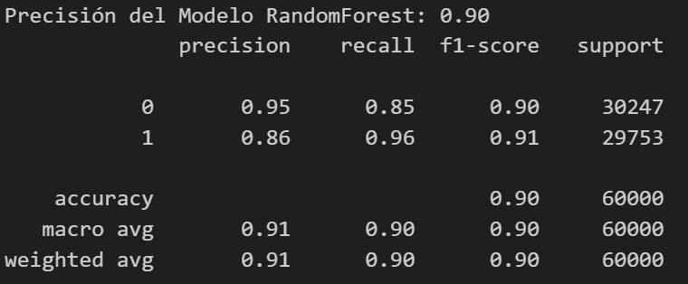

# DESARROLLO TALLER 2.                       
Códigos entregables universidad Nariño    
Desarrollado Por:                         
* Juan José Torres Quiñonez. 220160099.            
* Jeison Guillermo Moreno Eraso. 220160072.  
* Jonathan David Rosero Moreno. 220160119.

* Introducción:
En el presente trabajo se pretende desarrollar por medio de código en python, el entrenamiento de una red neuronal para la clasificación de datos faltantes importados con SQL calificando el precisión de dicha predicción.

* Objetivos:
Entrenar el código con los datos disponibles.
Clasificar los datos faltantes.
Exportar la salida con formato CSV.
Evaluar el rendimiento del modelo.

* Descripción:
El programa contiene el desarrollo del segundo taller de Profundización de Automatización y Control.
Código para identificación de datos positivos y negativos con entrenamiento de Machine Learning.
Para correr el programa, por favor, ejecute cada fragmento en orden.

* Resultados:
Se logró entrenar el código con los datos disponibles.
Se evidencia la clasificación de los datos faltantes.
Como puede observarse, la salida está exportada en formato CSV tal y como se pidió.
Al evaluar el rendimiento del modelo, podemos decir en base a la siguiente imagen que el modelo trabaja correctamente: 

